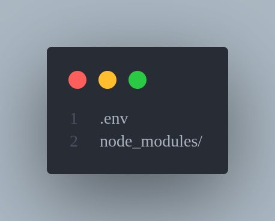
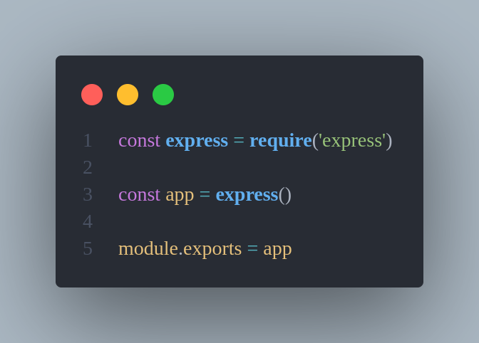
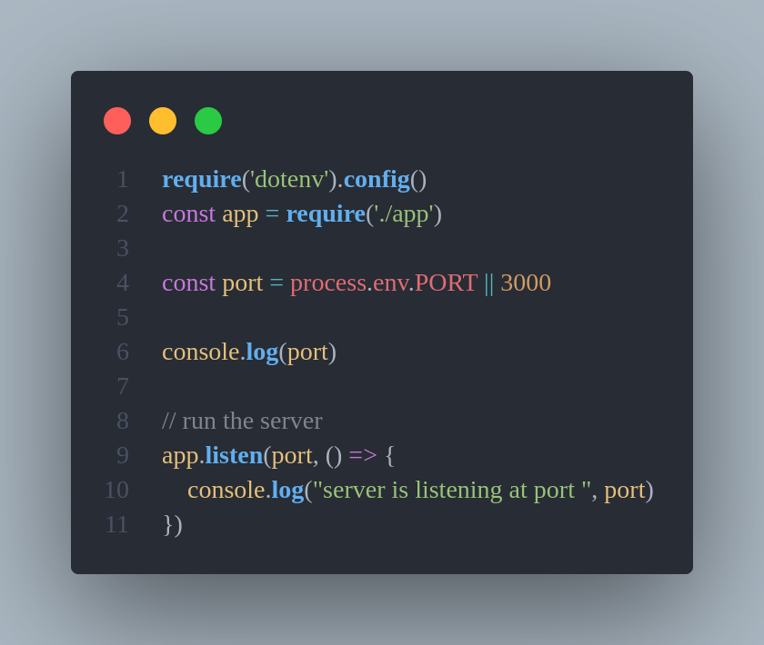
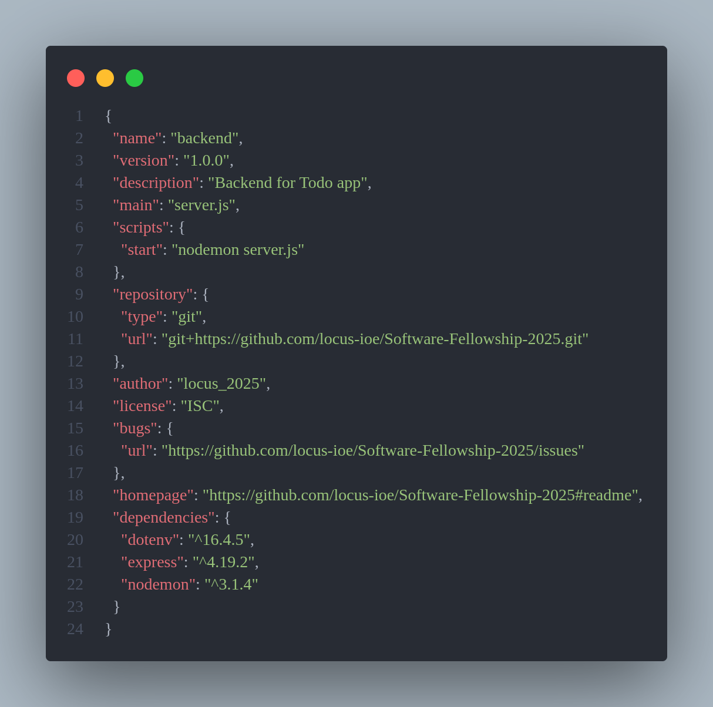

# Documentation of TODO app.

## Initialization of Project

```bash
npm init
```

## Create required folders and files
- brief description of folders
- Explanation of .env and .gitignore


## Installation of packages (express and nodemon)
```bash
npm i express nodemon dotnenv
```
## Basic express setup


- set PORT = 3000 in .env



## Nodemon setup


